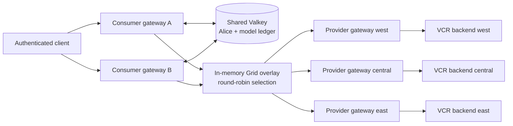
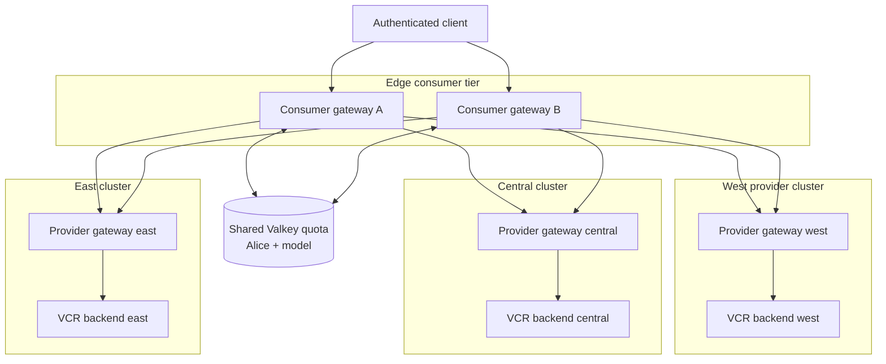
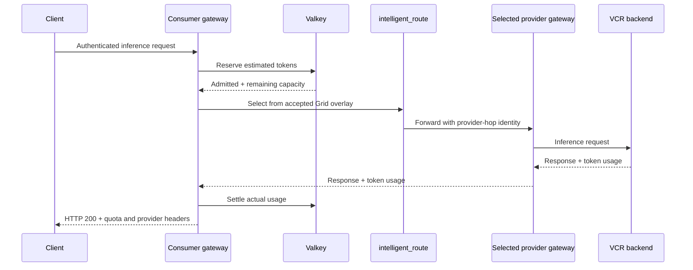
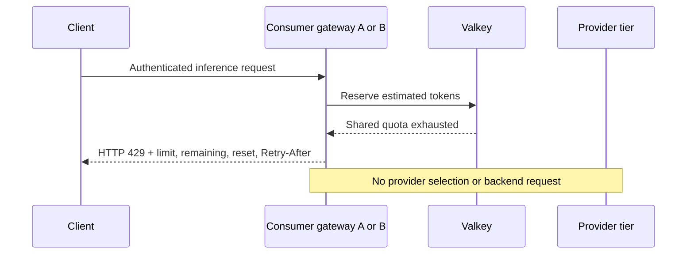

# Distributed token rate limiting with Grid routing

This experimental demo combines authenticated token quotas with provider-level
Grid routing. Two independent consumer gateways enforce one shared quota for
Alice and a model through Valkey. Requests admitted by the quota layer are then
distributed across three provider gateways by the Grid-provided round-robin
selection contract.

> [!IMPORTANT]
> This is early exploratory work intended to validate the architecture and
> inform the proposals that will define the upstream implementation. The demo
> assembles development versions of capabilities spanning Praxis, Praxis AI,
> Grid, and supporting observability components. Its branches and images provide
> a reproducible integration snapshot, not the final upstream design or a stable
> deployment contract. Configuration, APIs, ownership boundaries, and runtime
> behavior are expected to evolve as the proposals are reviewed and the work is
> implemented in the appropriate upstream components.
>
> Expect the deployment to require some hands-on troubleshooting. Several
> components and their integration contracts are still carried on out-of-tree
> development branches rather than coordinated releases.

<!-- markdownlint-disable-next-line MD034 -->
https://github.com/user-attachments/assets/7d72e292-8183-4a25-aadb-995c9578efb4

## What this demonstrates

- Basic authentication publishes a trusted `identity.user_id` only after the
  credentials have been verified.
- A shared Valkey ledger lets a horizontally scaled fleet of consumer gateways
  enforce one Alice/model quota instead of multiplying the quota per replica.
- An admitted request is routed to the west, central, or east provider gateway.
- Provider selection rotates across the active Grid group without calling Grid
  or Valkey for the routing decision.
- Once the shared 60-token window is exhausted, either consumer returns HTTP
  `429` before a provider is contacted.
- Capacity returns incrementally as entries age out of the sliding window.
- A Valkey outage fails closed with HTTP `503` rather than bypassing the quota.

## Architecture



The responsibilities are intentionally separate:

| Component | Responsibility |
| --- | --- |
| Praxis authentication | Verify credentials and publish the authenticated principal. |
| Praxis AI quota filter | Reserve and settle tokens against the shared Valkey ledger. |
| Grid operator | Publish eligible providers, group boundaries, and round-robin selection mode. |
| Praxis AI routing filter | Select a provider locally from the accepted overlay snapshot. |
| Provider gateway and VCR | Enforce the provider boundary and serve the inference request. |

Grid does not store quota state or enforce token limits. Valkey is not involved
in provider selection. These boundaries keep quota policy and control-plane work
outside provider routing while still allowing admitted traffic to use Grid.
Because quota reservations are stored in Valkey, any gateway configured with the
same backend, namespace, and policy can enforce the same logical quota. Adding or
restarting a gateway does not create a fresh allowance for that principal.

## Topology

The logical topology is a pyramid. Two independently addressable edge consumer
gateways sit above one shared quota ledger and route admitted requests into a
three-cluster provider tier. Each provider cluster contains one provider gateway
and one VCR-backed inference workload.



The two consumer gateways demonstrate that the quota survives process boundaries
and consumer restarts. The same design can extend across a horizontally scaled
fleet of gateway replicas. Their round-robin counters are intentionally local,
so the demo claims aggregate distribution across providers, not one globally
synchronized sequence shared by all consumers.

### Request sequences

An admitted request reserves quota before provider selection. Grid has already
published the provider set and selection mode, so Praxis selects locally from
its in-memory overlay.



When the shared window is exhausted, the request stops at quota admission. It
does not enter routing and cannot contact a provider or backend.



## Prerequisites

- Linux with Docker
- Kind, `kubectl`, and Helm
- Rust toolchain compatible with the Grid branch
- Git and `curl`
- At least 16 GiB of available memory for three Kind clusters

Confirm the local tools before deployment:

```bash
docker info
kind version
kubectl version --client
helm version
cargo --version
```

## Run with prebuilt images

Clone the exact Grid demo branch. Its Forge topology already references the
published images listed below with `IfNotPresent` pull policy.

```bash
git clone --branch poc/distributed-token-rate-limit-demo https://github.com/nerdalert/grid.git grid-token-rate-limit
cd grid-token-rate-limit
cargo run -p forge -- --config tests/e2e/topologies/grid-token-rate-limit/forge.yaml up
```

The deployment uses:

```text
ghcr.io/nerdalert/praxis-ai:token-rate-limit-demo-20260818
ghcr.io/nerdalert/grid-operator:token-rate-limit-demo-20260818
ghcr.io/nerdalert/grid-overlay-sync:token-rate-limit-demo-20260818
ghcr.io/nerdalert/praxis-tracing:token-rate-limit-demo-20260818
ghcr.io/neuralmagic/vllm-vcr:vllm0.23
```

Immutable digests for the demo-owned images:

| Image | Digest |
| --- | --- |
| `praxis-ai` | `sha256:b4380172f36339a3eef9c1130853ace895c3c47a5674545e318990bd34771fe7` |
| `grid-operator` | `sha256:10095d53bfdfb12e8798ac20b9caa80f4b3fa61842695763bbe2f60ddb164897` |
| `grid-overlay-sync` | `sha256:a8ded0be9de4e224c8efeb6ff593e2148afe5956c3b979f0c9a8101f7da162cc` |
| `praxis-tracing` | `sha256:9d78af9b04c49666b5867681ac60bd09bfda76d5d2b1b395dda3eb72269d8eb3` |

Inspect readiness and the three-candidate overlays:

```bash
kind get clusters
kubectl --context kind-grid-token-rate-limit-west -n grid-system get deploy,pods
kubectl --context kind-grid-token-rate-limit-west -n grid-system get configmap -l app.kubernetes.io/part-of=grid
```

The topology contains the consumer credentials and test quota configuration.
They are demonstration fixtures only and must not be reused in another
environment.

## Build the images from source

Use the exact source branches so the authenticated-principal, quota, routing,
and UI contracts remain aligned:

```bash
git clone --branch poc/authenticated-principal-metadata https://github.com/nerdalert/praxis.git praxis
git clone --branch poc/distributed-token-rate-limit-demo https://github.com/nerdalert/ai.git ai
git clone --branch poc/distributed-token-rate-limit-demo https://github.com/nerdalert/grid.git grid
git clone --branch feat/distributed-token-rate-limit-demo https://github.com/nerdalert/praxis-tracing.git praxis-tracing
```

Build the images with the names expected by the Forge topology:

<!-- markdownlint-disable MD013 -->
```bash
docker build -f ai/Containerfile -t ghcr.io/nerdalert/praxis-ai:token-rate-limit-demo-20260818 ai
docker build -f grid/deploy/operator/Containerfile -t ghcr.io/nerdalert/grid-operator:token-rate-limit-demo-20260818 grid
docker build -f grid/overlay-sync/Containerfile -t ghcr.io/nerdalert/grid-overlay-sync:token-rate-limit-demo-20260818 grid
docker build -f praxis-tracing/routing-observability-ui/Containerfile -t ghcr.io/nerdalert/praxis-tracing:token-rate-limit-demo-20260818 praxis-tracing/routing-observability-ui
```
<!-- markdownlint-enable MD013 -->

For a completely local run, create the clusters first and load the locally built
images before asking Forge to apply the stacks:

<!-- markdownlint-disable MD013 -->
```bash
CONFIG=tests/e2e/topologies/grid-token-rate-limit/forge.yaml
for cluster in west central east; do
  cargo run -p forge -- --config "$CONFIG" cluster create "$cluster"
  cargo run -p forge -- --config "$CONFIG" cluster load-image "$cluster" ghcr.io/nerdalert/praxis-ai:token-rate-limit-demo-20260818
  cargo run -p forge -- --config "$CONFIG" cluster load-image "$cluster" ghcr.io/nerdalert/grid-operator:token-rate-limit-demo-20260818
  cargo run -p forge -- --config "$CONFIG" cluster load-image "$cluster" ghcr.io/nerdalert/grid-overlay-sync:token-rate-limit-demo-20260818
  cargo run -p forge -- --config "$CONFIG" cluster load-image "$cluster" ghcr.io/nerdalert/praxis-tracing:token-rate-limit-demo-20260818
done
cargo run -p forge -- --config "$CONFIG" up
```
<!-- markdownlint-enable MD013 -->

Using the published images is the simpler cold-start path.

## Validate the request flow

Forward the two consumer services in separate terminals:

```bash
kubectl --context kind-grid-token-rate-limit-west -n grid-system port-forward svc/consumer-gateway-a 18080:8080
kubectl --context kind-grid-token-rate-limit-west -n grid-system port-forward svc/consumer-gateway-b 18081:8080
```

Send requests as Alice through both entries. Use the Basic Auth password from
the west consumer fixture in the checked-out topology:

```bash
for port in 18080 18081 18080 18081; do
  curl -i -u 'alice:alice-secret' \
    -H 'Content-Type: application/json' \
    -H 'X-Model: Qwen/Qwen3-0.6B' \
    -X POST "http://127.0.0.1:${port}/v1/chat/completions" \
    -d '{"model":"Qwen/Qwen3-0.6B","messages":[{"role":"user","content":"Explain quorum."}],"max_tokens":15}'
done
```

For admitted requests, inspect the provider-attribution and rate-limit headers.
After the shared 60-token window is consumed, the next request through either
consumer must return `429`, include limit/remaining/reset information, and omit
provider attribution. Waiting for entries to age out restores capacity
incrementally; this is sliding-window recovery, not a global reset.

## Tracing UI

The optional observability stack enables the token-rate-limit profile only when
`TRACING_UI_TOKEN_RATE_LIMIT=true`. It presents one row per request, distinguishes
Consumer A from Consumer B, shows the selected provider for admitted requests,
and leaves the provider path empty for requests denied before routing.

Open the UI and Jaeger with two additional port-forwards:

```bash
kubectl --context kind-grid-token-rate-limit-west -n praxis-tracing port-forward svc/praxis-tracing-ui 3000:8080
kubectl --context kind-grid-token-rate-limit-west -n praxis-tracing port-forward svc/jaeger-query 16686:16686
```

Then visit `http://127.0.0.1:3000` and `http://127.0.0.1:16686`.

The UI is a demonstration surface. The quota contract is enforced by Praxis AI
and Valkey, independently of whether the UI is deployed.

## Teardown

```bash
cargo run -p forge -- --config tests/e2e/topologies/grid-token-rate-limit/forge.yaml down
```

Verify cleanup:

```bash
kind get clusters
docker network ls --filter name=grid-token-rate-limit
```

## Current scope

This is experimental code. It demonstrates an exact shared sliding-window
ledger on one private Valkey instance, fail-closed backend behavior, and local
provider selection from immutable Grid overlays. It does not claim Valkey high
availability, multi-region quota storage, dynamic policy administration, or a
globally synchronized round-robin counter.

JWT/OIDC authentication is pending. Basic Auth is used here as a small,
auditable producer of the same authenticated-principal metadata contract that a
future JWT/OIDC filter can populate. The quota filter is keyed by that generic
identity metadata rather than by Basic Auth-specific fields.

## Related work

- [Canonical token-rate-limit proposal](https://github.com/praxis-proxy/ai/pull/658)
- [Provider selection in Praxis AI](https://github.com/praxis-proxy/ai/pull/731)
- [Provider selection contract in Grid](https://github.com/praxis-proxy/grid/pull/65)
- [Basic authentication in Praxis](https://github.com/praxis-proxy/praxis/pull/824)
- [Authenticated-principal source branch](https://github.com/nerdalert/praxis/tree/poc/authenticated-principal-metadata)
- [Distributed quota source branch](https://github.com/nerdalert/ai/tree/poc/distributed-token-rate-limit-demo)
- [Grid topology source branch](https://github.com/nerdalert/grid/tree/poc/distributed-token-rate-limit-demo)
- [Tracing UI source branch](https://github.com/nerdalert/praxis-tracing/tree/feat/distributed-token-rate-limit-demo)
